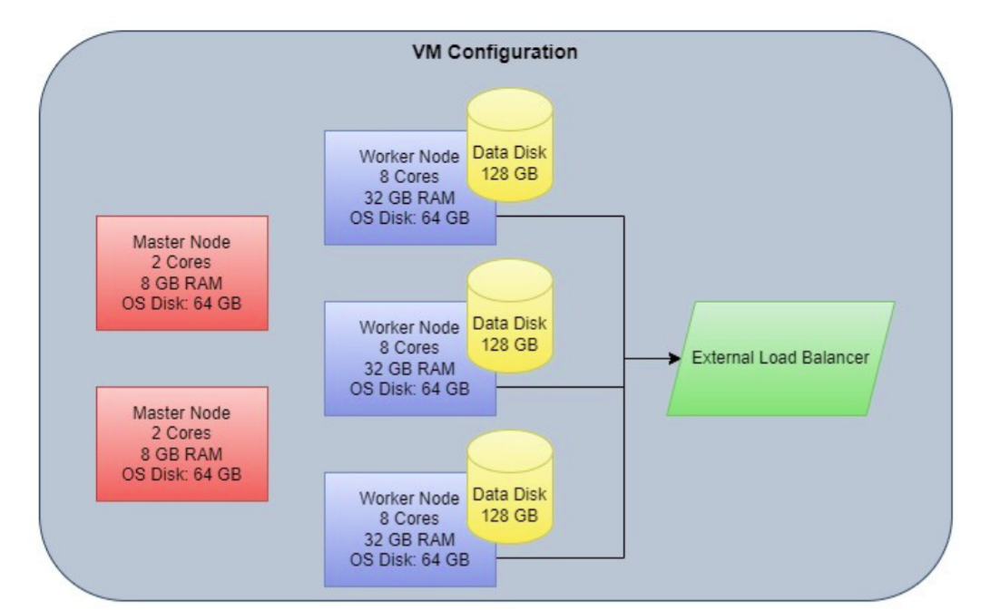
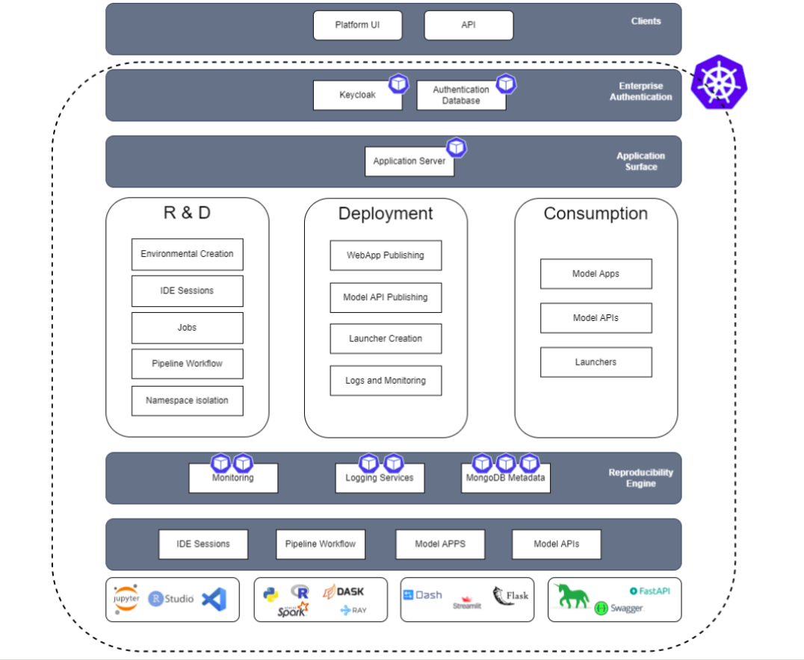

Architecture
=====

Infrastructure diagram of Katonic. 

Katonic runs on a Kubernetes cluster with  a set of master nodes and worker nodes dedicated to hosting Katonic platform services. Cluster contains a durable storage system, and a load balancer that regulates connections from users. 

Overview
------------

The Katonic application hosts two major workloads: 

1. Platform Workloads 

   * These components provide user interfaces, orchestration, metadata and supporting services. 

2. Compute Workloads 

   * This is where users’ data science, engineering, and machine learning workflows are executed. 

All workloads in the Katonic application run as containerized processes, orchestrated by Kubernetes. Kubernetes is an industry-standard container orchestration system. Kubernetes was launched by Google and has broad community and vendor support, including managed offerings from all major cloud providers. 

Typically, Katonic customers will provision and manage their own Kubernetes cluster into which they install Katonic. Katonic can advise on best practices for creating and managing Kubernetes clusters. Please talk to your account executive for more information about deployment options.

Services
----------------

Katonic services are best understood when arranged into logical layers based on function and communication. A description of the functionality provided by each layer follows. 

 
**Client layer** 

The client layer contains the Frontend pods that are the targets of a network load balancer. Katonic users can access Katonic’s core features by connecting to the dashboard via web browser, in which case the Frontend serves the Katonic application 

The Dashboard runs on platform nodes. 

**Service layer** 

The service layer contains the Katonic API server, Dispatcher, Keycloak authentication service, and the metadata services that Katonic uses to provide reproducibility and collaboration features. MongoDB stores application object metadata, Git manages code and file versioning, Elasticsearch powers in-app search, and the Docker registry is used by Katonic Environments. Project data, logs, and backups are written to durable storage. 

All of these services run on platform nodes. 

The service layer also contains the dedicated master nodes for the Kubernetes cluster. 

**Execution layer** 

The execution layer is where Katonic will launch and manage ephemeral pods that run user workloads. These may host Jobs, Model APIs, Apps, Workspaces, and Docker image builds. 

These run on compute nodes. 

Software
----------------

The Katonic platform runs or depends on the following software components. 

**Application services** 

The following primary application services run on platform nodes in the Katonic Kubernetes cluster. 

 * Apache Oauth2-proxy 

APache Oauth2 proxy is an open source HTTP and reverse proxy server. Katonic uses Apache Oauth2-proxy to serve the Katonic web application and as a reverse proxy to route requests to internal services. 

'Learn about Apache Oauth2 proxy <https://oauth2-proxy.github.io/oauth2-proxy/docs/configuration/overview/>'_

.. _Learn about Apache Oauth2 proxy <https://oauth2-proxy.github.io/oauth2-proxy/docs/configuration/overview/>

 * Katonic API server 

The Katonic application exposes the Katonic API and handles REST API requests from the web application and user clients. 

 * Katonic dispatcher 

The Katonic dispatcher handles orchestration of workloads on compute nodes. The dispatcher launches new compute pods, connects results telemetry back to the Katonic application, and monitors the health of running workloads. 

 * Keycloak 

Keycloak is an enterprise-grade open source authentication service. Katonic uses Keycloak to store user identities and properties, and optionally for identity brokering or identity federation to SSO systems and identity providers. 

* Keycloak supports the following protocols: 

 * SAML v2.0 

 * OpenID Connect v1.0 

 * OAuth v2.0 

 * LDAP(S) 

'Learn more about Keycloak <https://www.keycloak.org/index.html>'_ 

.. _Learn more about Keycloak <https://www.keycloak.org/index.html>

**Supporting services** 

These metadata, communication, and processing services run on platform nodes. 

 * MongoDB 

MongoDB is an open source document database. Katonic uses MongoDB to store Katonic entities, like projects, users, and organizations. Katonic stores the structure of these entities in MongoDB, but underlying data is stored separately in encrypted blob storage. 

'Learn more about MongoDB <https://www.mongodb.com/what-is-mongodb>'_

.. _Learn more about MongoDB <https://www.mongodb.com/what-is-mongodb>

 * Git 

Git is a free and open source distributed version control system. Katonic uses Git internally for revisioning projects and files. Katonic Executors also run Git clients, and they can interact with user-controlled external repositories to access code or data. 

'Learn more about Git <https://git-scm.com/>'_ 

.. _Learn more about Git <https://git-scm.com/>

 * Elasticsearch 

Elasticsearch is a distributed, RESTful search and analytics engine. Katonic uses Elasticsearch to power user searches for Katonic objects like projects, files, and models. Katonic also uses Elasticsearch for logging. 

'Learn more about Elasticsearch <https://www.elastic.co/products/elasticsearch>'_ 

.. _Learn more about Elasticsearch <https://www.elastic.co/products/elasticsearch>

 * Docker registry 

The Docker registry is an application used to store and distribute Docker images. Katonic uses its registry to store images for Katonic environments and Model APIs. These images are built to user specifications by compute nodes. 

'Learn more about Docker registry <https://docs.docker.com/registry/>'_ 

.. _Learn more about Docker registry <https://docs.docker.com/registry/>

 * Fluentd 

Fluentd is an open source application that unifies and processes logging and telemetry data. Katonic uses Fluentd to aggregate logs and forward data to durable storage. 

'Learn more about Fluentd <https://www.fluentd.org/>'_ 

.. _Learn more about Fluentd <https://www.fluentd.org/>

 * Redis 

Redis is an open source data structure cache. Katonic uses Redis to cache logs in-memory for streaming back to users through the web application. 

'Learn more about Redis <https://redis.io/>'_ 

.. _Learn more about Redis <https://redis.io/>

 * RabbitMQ 

RabbitMQ is an open source message broker. Katonic uses RabbitMQ as an event bus to asynchronously distribute event messages between Katonic services. 

'Learn more about RabbitMQ <https://www.rabbitmq.com/>'_

.. _Learn more about RabbitMQ <https://www.rabbitmq.com/>

 * Postgres 

Postgres is an open source relational database system. Katonic uses Postgres as a storage system for Keycloak data on user identities and attributes. 

'Learn more about Postgres <https://www.postgresql.org/>'_ 

.. _Learn more about Postgres <https://www.postgresql.org/>

User accounts
----------------

Katonic uses Keycloak to manage user accounts. Keycloak supports the following modes of authentication to Katonic. 

**Local accounts** 

When using local accounts, anyone with network access to the Katonic application may create a Katonic account. Users supply a username, password, and email address on the signup page to create a Katonic-managed account. Katonic administrators can track, manage, and deactivate these accounts through the application. Katonic can be configured with multi-factor authentication and password requirements through Keycloak. 

'Learn more about Keycloak administration <https://www.keycloak.org/docs/latest/server_admin/index.html>'_

.. _Learn more about Keycloak administration <https://www.keycloak.org/docs/latest/server_admin/index.html>

**Identity federation** 

Keycloak can be configured to integrate with an Active Directory (AD) or LDAP(S) identity provider (IdP). When identity federation is enabled, local account creation is disabled and Keycloak will authenticate users against identities in the external IdP and retrieve configurable properties about those users for Katonic usernames and email addresses. 

'Learn more about Keycloak identity federation <https://www.keycloak.org/docs/latest/server_admin/index.html#_user-storage-federation>'_

.. _Learn more about Keycloak identity federation <https://www.keycloak.org/docs/latest/server_admin/index.html#_user-storage-federation>

**Identity brokering** 

Keycloak can be configured to broker authentication between Katonic and an external authentication or SSO system. When identity brokering is enabled, Katonic will redirect users in the authentication flow to a SAML, OAuth, or OIDC service for authentication. Following authentication in the external service, the user is routed back to Katonic with a token containing user properties. 

'Learn more about Keycloak identity brokering <https://www.keycloak.org/docs/latest/server_admin/index.html#_identity_broker>'_

.. _Learn more about Keycloak identity brokering <https://www.keycloak.org/docs/latest/server_admin/index.html#_identity_broker>

Service mesh
----------------
A service mesh provides a transparent and language-independent way to flexibly and easily automate application network functions, such as: traffic routing, load balancing, observability, and encryption. Katonic can optionally deploy or integrate with Istio, an open source service mesh.  

'Learn more about Istio <https://istio.io/>'_

.. _Learn more about Istio <https://istio.io/>