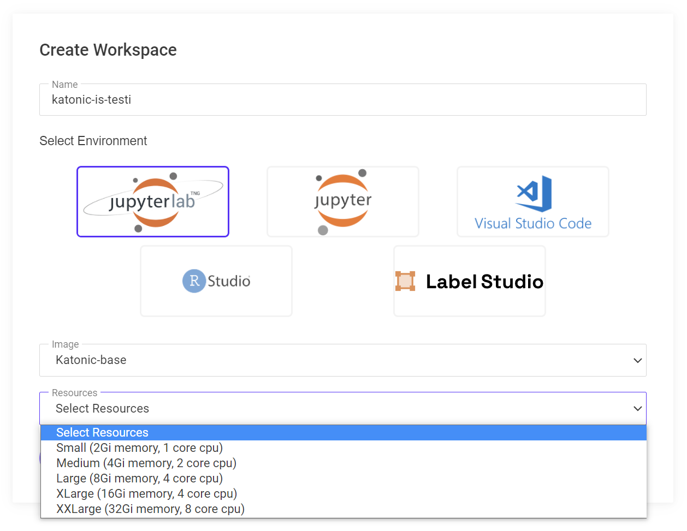
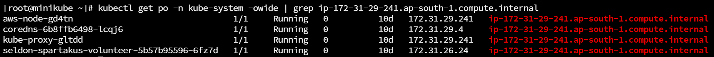
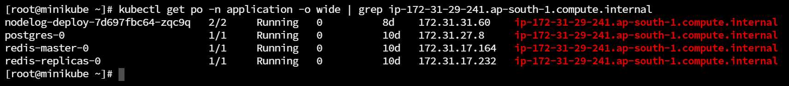

Compute
===============
Managing Compute Resources 
---------------------------------

**Hardware tiers** 

When launching a Katonic Workspace, users specify a Hardware Tier that determines the resources available for the execution of the workspace. 

**Resource requests and limits** 

At a Kubernetes level, Hardware Tiers specify the CPU, Memory (and optionally GPU) for the pods that will host the executions. The following properties are used to configure the resource requests and limits for execution pods. 

 * Cores Requested The number of requested CPUs. 

 * Cores Limit The maximum number of CPUs. Recommended to be the same as the request. 

 * Memory Requested (GiB) The amount of requested memory. 

 * Memory Requested (GiB) The maximum amount of memory. Recommended to be the same as the request. 

 * Number of GPUs (Optional) The number of requested GPUs. 

The request values, CPU Cores, Memory, and GPUs, are thresholds used to determine whether a node has capacity to host an execution pod. These requested resources are effectively reserved for the pod. The limit values control the number of resources a pod can use above and beyond the amount requested. If there’s additional headroom on the node, the pod can use resources up to this limit. 

However, if resources are in contention, and a pod is using resources beyond those it requested, and thereby causing excess demand on a node, the offending pod may be evicted from the node by Kubernetes and the associated Workspace is terminated. For this reason, Katonic strongly recommends setting the requests and limits to the same values. 

Keep in mind that your Hardware Tier’s CPU, memory, and GPU requests must not exceed the available resources of the machines in the target node pool after accounting for overhead. Otherwise, an execution using such Hardware Tier will never start. If you need more resources than are available on existing nodes, you may need to add a new node pool with different specifications. This may mean adding individual nodes to a static cluster, or configuring new auto-scaling components that provision new nodes with the required specifications and labels. 

**Scaling compute capacity** 

The amount of compute power required for your cluster will fluctuate over time as users start and stop executions. Katonic Platform relies on Kubernetes to find space for each execution on existing compute resources. In cloud autoscaling environments, if there’s not enough CPU or memory to satisfy a given execution request, the Kubernetes cluster Autoscaler will start new compute nodes to fulfil that increased demand. In environments with static nodes, or in cloud environments where you have reached the autoscaling limit, the execution request will be queued until resources are available. 

Autoscaling Kubernetes clusters will shut nodes down when they are idle for more than a configurable duration. This reduces your costs by ensuring that nodes are used efficiently, and terminated when not needed. 

Cloud autoscaling resources have properties like the minimum and maximum number of nodes they can create. You should set the node maximum to whatever you are comfortable with given the size of your team and expected volume of workloads. All else equal, it is better to have a higher limit than a lower one, as compute node cost is are cheap to start up and shut down, while your data scientists’ time is very valuable. If the cluster cannot scale up any further, your users’ executions will wait in a queue until the cluster can service their request. 

Persistent volume management 
---------------------------------

**Overview** 

When not in use, all Katonic project files are stored and versioned in the Katonic’s data storage. When a Workflow run is started from a project, the projects files are connected using a Kubernetes persistent volume that is attached to the compute node and mounted in the run. Run the following command to see all current persistent volumes: 

``$ kubectl get pv`` 

**Definitions** 

 * `Persistent Volume (PV) <https://kubernetes.io/docs/concepts/storage/persistent-volumes/>`_

.. _Persistent Volume (PV): <https://kubernetes.io/docs/concepts/storage/persistent-volumes/>

A storage volume in a Kubernetes cluster that can be mounted to pods. The system dynamically creates persistent volumes to provide local storage for active runs. 

 * `Persistent Volume Claim (PVC) <https://kubernetes.io/docs/concepts/storage/persistent-volumes/#persistentvolumeclaims>`_

.. _Persistent Volume Claim (PVC): <https://kubernetes.io/docs/concepts/storage/persistent-volumes/#persistentvolumeclaims>

A request made in Kubernetes by a pod for storage. The system uses these to match a new run with either a new or idle PV that has the project’s files cached. 

 * `Storage Class <https://kubernetes.io/docs/concepts/storage/storage-classes/>`_

.. _Storage Class: <https://kubernetes.io/docs/concepts/storage/storage-classes/>

Kubernetes’ method of defining the type, size, provisioning interface, and other properties of storage volumes. 

**Storage workflow for pipelines** 

When a user starts a new pipeline, the platform will broker assignment of new execution pods to the cluster. These pods will have an associated PVC which the type of storage that Kubernetes requires. Kubernetes will then create a new PV for this PVC according to the Storage Class. 

**Storage workflow for Workspaces** 

Workspace volumes are handled differently than volumes for pipelines. Workspaces are potentially long-lived development environments that users will stop and resume repeatedly without being terminated for a long time. As a result, the PV for the workspace is a similarly long-lived resource that stores the user’s working data. 

These workspace PVs are durably associated with the durable workspace they are initially created for. Each time that the workspace is stopped, the PV is detached and preserved so that it is available the next time the user starts the workspace. When the workspace starts again, it reattaches its PV and the user will see all their working data saved during the last session. 

A durable workspace PV will only be deleted if the user deletes the associated workspace. 

Hardware Tier best practices
--------------------------------

Model resource quotas
------------------------

Adding a node pool to your cluster
---------------------------------------------

**Overview** 

Making a new node group available to your Katonic Platform Cluster is as simple as adding new Kubernetes worker nodes to the Cluster. As soon as the new nodes are connected to the Cluster, the Katonic Platform will automatically allocate work onto the new node as per requirement. 

In case of EKS or AKS this is done automatically by scaling the number of nodes in the specific cluster. For On-Premise Bare metal installation, new worker nodes can be added to the cluster using the kubeadm join command. 

Removing a node from service
-------------------------------

**Overview** 

There may be times when you need to remove a specific node (or multiple nodes) from service, either temporarily or permanently. This may include cases of troubleshooting nodes that are in a bad state, or retiring nodes after an update to the AMI so that all nodes are using the new AMI. 

This page describes how to temporarily prevent new workloads from being assigned to a node, as well as how to safely remove workloads from a node so that it can be permanently retired. 

**Temporarily removing a node from service** 

``The kubectl cordon <node>`` command will prevent any additional pods from being scheduled onto the node, without disrupting any of the pods currently running on it. For example, let’s say a new node in your cluster has come up with some problems, and you want to cordon it before launching any new runs to ensure they will not land on that node. 

You can undo this and return the node to service with the command ``kubectl uncordon <node>``.  

**Permanently removing a node from service** 

Before removing a node from service permanently, you should ensure there are no workloads still running on it that should not be disrupted. For example, you might see the following workloads running on a node.

Here, there are different types of pods running on these workspaces. Different types of workloads should be treated differently. Pods like ``redis-master-0`` are important long-running workload pods running on the cluster while pods like ``kube-proxy-gltdd`` are node specific pods that are not part of the Katonic AI platform. 

For the long-running workloads governed by a Kubernetes deployment, you can proactively move the pods off of the cordoned node by running a command like this: 

``$ kubectl rollout restart deploy redis-master -n application`` 

Notice the name of the deployment is the same as the first part of the name of the pod in the above section. You can see a list of all deployments in the compute namespace by running ``kubectl get deploy -n application`` 

Whether the associated app or model experiences any downtime will depend on the update strategy of the deployment. For example, the ``redis-master`` deployment has only 1 pod. The Deployment in this case would experience some downtime, since the old pod will be terminated immediately. If desired, you can edit the deployments to change these settings and avoid downtime. 

 

Once all Essential pods are removed from the node, it is ready to be removed from the cluster. 
