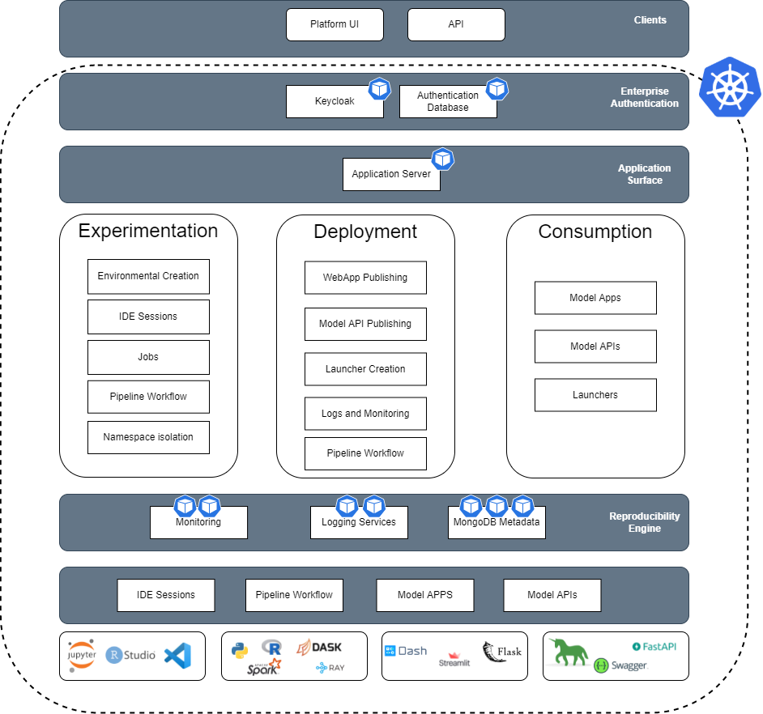

About Katonic 3.1
===================================

Katonic MLOps platform is a Collaborative platform with a unified UI to manage all data science in one place. The Platform combines the creative scientific process of data scientists with the professional software engineering process to build and deploy Machine Learning Models into production safely, quickly, and in a sustainable way. 

.. toctree::
   :maxdepth: 2
   :caption: Contents

   Pages/Architecture
   Pages/Kubernetes
   Pages/Installation
   Pages/Configuration
   Pages/Compute
   Pages/Authentication
   Pages/Operations
   Pages/Data
   Pages/Users
   Pages/Environments
   Pages/Disaster Recovery
   Pages/Control Center
   Pages/api

All Katonic components run in Kubernetes :ref:`https://kubernetes.io/'. You can run an instance of Katonic in the cloud or on-premises in your office or data center. 

Links
=====

* :ref:`search`
* Sign Up : https://katonic.ai/pricing.html
* Home page: https://katonic.ai/
* Source code: https://github.com/katonic-dev/Katonic-ML-Marketplace
* Contact: ishan.chakraborty@katonic.ai
